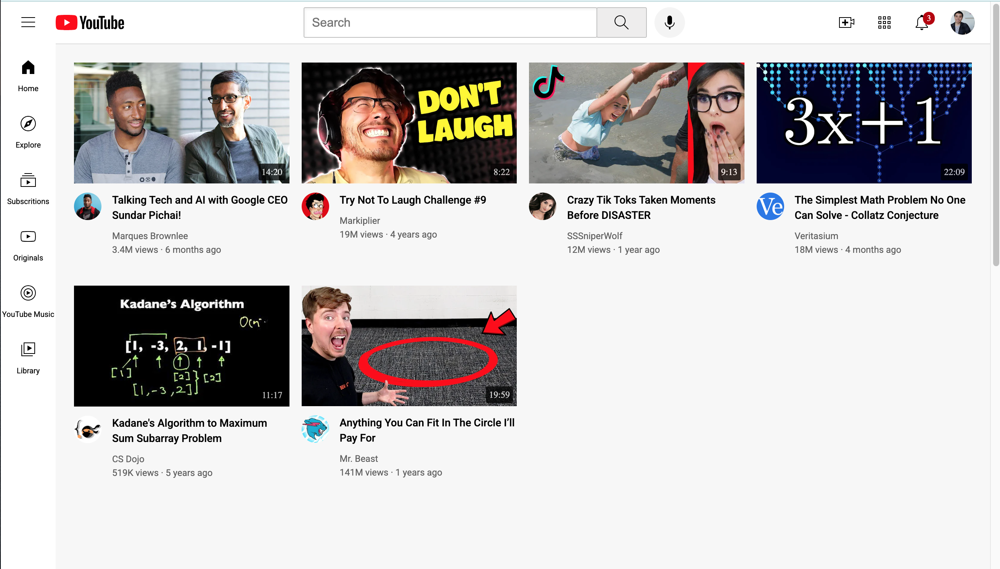

# YouTube Clone

A basic YouTube clone built for practice with HTML and CSS.  
This project was created to strengthen front-end skills by replicating the layout and styling of YouTube’s interface.

## Features
- Responsive layout
- Navigation bar with logo, search bar, and profile section
- Video grid displaying thumbnails, titles, and channel info
- Basic hover effects for interactivity

## Tech Stack
- HTML5
- CSS3 (Flexbox & Grid)

## Preview

## Purpose
This project is for practice only and does not include JavaScript functionality such as video playback or dynamic loading.  
It was built to improve CSS layout skills and replicate real-world UI design.

